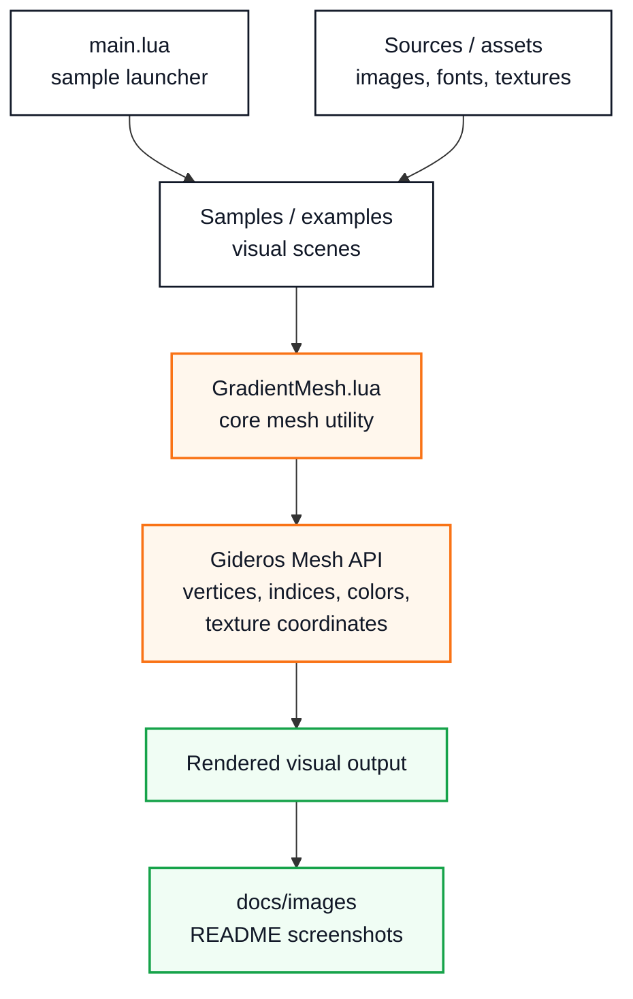

# Architecture

GradientMesh is intentionally small.

It is structured as a Gideros/Lua graphics utility with:

* a core mesh-generation module;
* sample scenes;
* source assets;
* rendered documentation screenshots;
* a Gideros project file;
* a sample launcher.

## Repository structure

```text
GradientMesh/
├── docs/images/            # Rendered examples and visual outputs
├── Samples/                # Gideros sample scenes
├── Sources/                # Images, fonts, and source assets
├── main.lua                # Sample selector
├── GradientMesh.lua        # Core gradient mesh utility
├── GradientMesh.gproj      # Gideros project file
├── LICENSE
└── README.md
```

## Responsibility map



## Core module

The main reusable unit is:

```text
GradientMesh.lua
```

It is responsible for generating geometry and assigning rendering data such as:

* vertices;
* triangle indices;
* colors;
* alpha values;
* texture coordinates;
* optional radial holes;
* optional antialiasing rings.

## Examples and samples

Examples demonstrate the intended use cases:

* gradient overlays;
* texture masking;
* hexagon portrait masks;
* radial shapes with holes and deformation;
* radial splash masks.

## Visual documentation

Rendered examples live in the GradientMesh repository under:

```text
docs/images/
```

The GitHub Pages documentation references those images through the source repository instead of duplicating them locally.
