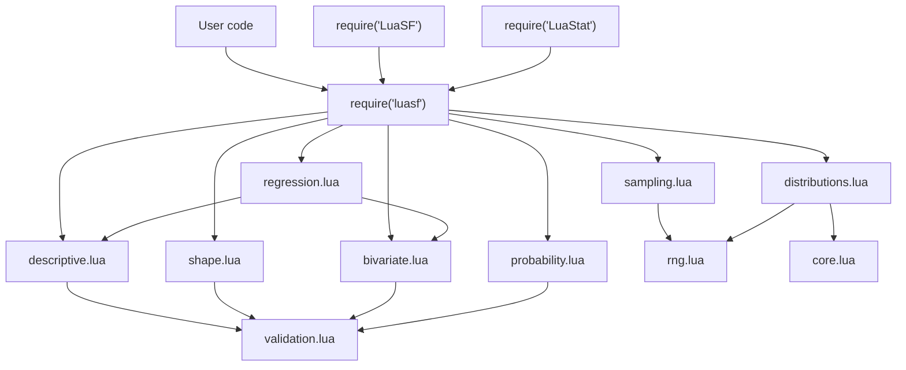

# Architecture

LuaSF keeps a stable public facade while moving implementation details into smaller internal modules.

## Public facade

Users normally load LuaSF with:

```lua
local stats = require("luasf")
```

Compatibility entry points remain available:

```lua
local stats = require("LuaSF")
local stats = require("LuaStat")
```

## Internal module layout

```text
LuaSF/
├── src/
│   ├── luasf.lua
│   └── luasf/
│       ├── core.lua
│       ├── descriptive.lua
│       ├── shape.lua
│       ├── bivariate.lua
│       ├── probability.lua
│       ├── sampling.lua
│       ├── distributions.lua
│       ├── regression.lua
│       ├── validation.lua
│       └── rng.lua
├── spec/
├── examples/
├── docs/
├── rockspec/
├── LuaSF.lua
├── LuaStat.lua
└── README.md
```

## Module responsibility map



## Design principles

- Keep the public API stable.
- Preserve legacy names.
- Add modern aliases without breaking older examples.
- Keep LuaSF dependency-light.
- Prefer readable formula-based helpers.
- Keep machine learning workflows outside the current scope.

## Compatibility strategy

LuaSF keeps legacy functions such as:

```text
sumF
avF
stvF
frecuencyF
nomalVA
normalVA
normal_inv_D
bernoulliVA
unifVA
expoVA
weibullVA
erlangVA
trianVA
binomialVA
geometricVA
poissonVA
chiSquareVA
studentTVA
gamVA
lognoVA
lognoRandVA
```

Modern aliases are added on top of those names instead of replacing them.