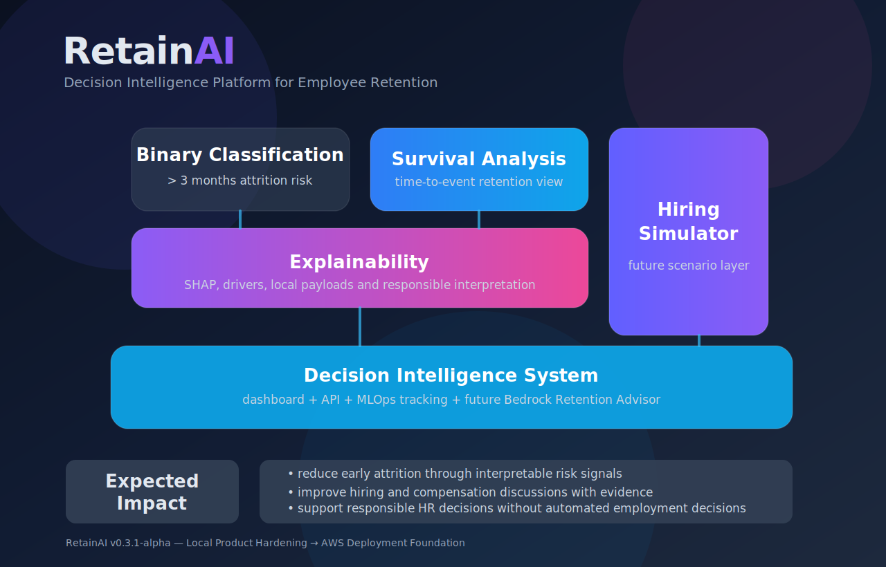

# RetainAI

<p align="left">
  
  
  
  
  
  
  
  
  
  
  
  
  
</p>

### Decision Intelligence Platform for Employee Retention

**RetainAI** is an end-to-end Machine Learning, Explainable AI, MLOps, and
secure multicloud platform for employee-retention analytics.

Rather than providing only employee attrition prediction, RetainAI combines:

- attrition classification;
- survival and time-to-event analysis;
- SHAP-based global and local explainability;
- reproducible experimentation and artifact tracking;
- API-backed prediction services;
- dashboard-driven decision support;
- validation and monitoring foundations;
- provider-neutral AI-assisted retention guidance.

The product is designed as a **Decision Intelligence System for Human
Resources**: analytical evidence remains reviewable, AI providers remain
optional, and high-impact employment decisions remain under human
accountability.

Product design, architecture, and AI-assisted development by
[Hubert Ronald](https://hubertronald.dev/).

## Project vision

RetainAI evolves traditional attrition prediction into an explainable,
multilingual, and provider-neutral retention-intelligence platform.

The long-term direction is to support workforce planning, retention-strategy
design, and responsible HR decision-making without coupling the product to a
single cloud or AI provider.

Amazon Bedrock and Google Gemini are treated as interchangeable advisor
adapters behind a controlled backend. They are not the product itself, and
remain disabled by default until evaluation, quota, privacy, and cost controls
are satisfied.

## Core capabilities

| Capability | Purpose |
|---|---|
| Attrition classification | Estimate employee attrition risk using supervised models |
| Survival analysis | Estimate retention duration and time-to-event behavior |
| Explainable AI | Surface SHAP drivers, feature importance, and evidence |
| Experiment tracking | Preserve reproducible runs, metrics, and artifacts |
| Prediction API | Expose controlled inference and explanation contracts |
| Streamlit dashboard | Present model evidence and decision-support outputs |
| Multicloud delivery | Run the public dashboard on GCP and the backend on AWS |
| Retention Advisor foundation | Route validated evidence to optional Gemini or Bedrock adapters |
| Monitoring roadmap | Add data quality, performance, drift, and validation reports |

<!-- retainai-architecture-visuals:start -->
## Architecture overview

RetainAI is a layered **Decision Intelligence System** that combines
reproducible data preparation, attrition classification, survival analysis,
SHAP explainability, experiment tracking, controlled API services, and
dashboard-driven decision support.

### Decision Intelligence core architecture

The core architecture presents the product at a high level, from analytical
foundations to decision support and the future advisor layer.

<p align="center">
  
</p>

### Current foundation and product evolution

The detailed view expands the core architecture and distinguishes capabilities
that are already implemented or deployed from those that remain planned,
optional, or disabled.

Solid elements represent the current foundation. Dashed elements represent the
evolution toward validation reports, monitoring and drift detection, evidence
retrieval, provider-neutral AI adapters, and the Retention Advisor.

[](./figs/retainai_decision_intelligence_architecture.svg)

[Architecture details](./reference/docs/architecture/#decision-intelligence-architecture)

## Current deployed multicloud architecture

The `v0.4` runtime is deployed and operational. Google Cloud hosts the public
product experience, while AWS owns the controlled backend boundary for
authentication, quota, prediction, explainability, and logging.

[](./figs/architecture/retainai_multicloud_runtime_v0_4.svg)

```text
The browser never receives the backend bearer token.
Cloud Run calls the AWS API from server-side Python only.
Lambda owns authentication, quota, logging, and provider routing.
Gemini and Bedrock remain disabled by default.
Application delivery is separate from Terraform infrastructure delivery.
```

[Runtime architecture details](./reference/docs/architecture/#current-deployed-multicloud-runtime)

<!-- retainai-architecture-visuals:end -->

## Live endpoints

| Surface | URL |
|---|---|
| Dashboard | <https://retainai.hubertronald.dev> |
| Backend API | <https://api.retainai.hubertronald.dev> |
| Portfolio | <https://hubertronald.dev> |

## Current release

`v0.4.0` establishes the multicloud product foundation:

- branded dashboard and API domains with managed HTTPS;
- Cloud Run dashboard and Lambda container backend;
- Terraform-managed AWS and GCP infrastructure;
- server-side bearer-token authentication;
- DynamoDB request quotas;
- Cloud Run scale-to-zero with a one-instance maximum;
- AI, RAG, and vector providers disabled by default;
- application delivery separated from infrastructure delivery;
- product documentation organized by architectural domain.

## Documentation

| Area | Guide |
|---|---|
| Documentation index | [docs/README.md](./reference/docs/) |
| Architecture | [docs/architecture/README.md](./reference/docs/architecture/) |
| Dashboard | [docs/dashboard/README.md](./reference/docs/dashboard/) |
| Data | [docs/data/README.md](./reference/docs/data/) |
| Exploratory analysis | [docs/eda/README.md](./reference/docs/eda/) |
| Modeling | [docs/modeling/README.md](./reference/docs/modeling/) |
| MLOps | [docs/mlops/README.md](./reference/docs/mlops/) |
| Multicloud delivery | [docs/multicloud/README.md](./reference/docs/multicloud/) |
| Prompt engineering | [docs/prompts/README.md](./reference/docs/prompts/) |

Additional project files:

- [Changelog](https://github.com/HubertRonald/RetainAI/blob/v0.4.0-alpha.1/reference/CHANGELOG)
- [Contributing](https://github.com/HubertRonald/RetainAI/blob/v0.4.0-alpha.1/reference/CONTRIBUTING)
- [Citation metadata](https://github.com/HubertRonald/RetainAI/blob/v0.4.0-alpha.1/CITATION.cff)

<!-- retainai-delivery-safety:start -->
## Application delivery and data safety

RetainAI separates application promotion, infrastructure management, and data
processing into independent operational paths.

Dashboard and backend images are promoted manually from `main` through GitHub
Actions using short-lived cloud identity and immutable image references.
Documentation-only changes do not qualify for an application release.

Terraform remains the source of truth for cloud infrastructure, including
domains, certificates, IAM, secrets, runtime configuration, quotas, and the
future protected S3 data-lake foundation. Routine application releases do not
run Terraform or perform S3 data operations.

See:

- [Manual multi-cloud application release](./reference/docs/multicloud/manual_application_release)
- [Multi-cloud architecture](./reference/docs/multicloud/)
- [Data architecture](./reference/docs/data/)
- [Architecture decisions](./reference/docs/architecture/)
<!-- retainai-delivery-safety:end -->

## Roadmap

- **v0.5 — Monitoring and validation:** data quality, model performance,
  prediction drift, validation reports, and retraining readiness.
- **v0.6 — Internationalization and provider abstraction:** English and Spanish
  locale catalogs, structured localized explanations, Gemini adapter, and
  Bedrock adapter.
- **v0.7 — Talent context and evaluation:** Resume Intelligence, structured
  context, explainability reports, evaluation datasets, and bias checks.
- **v1.0 — Retention Intelligence:** bilingual Retention Advisor, Resume
  Intelligence, monitoring, drift-aware evaluation, auditable explanations,
  and secure automated delivery.

Psychometric Intelligence remains outside the committed `v1.0` scope until
RetainAI has appropriate data, validated instruments, methodological evidence,
privacy and legal review, bias analysis, and qualified interpretation.

## Product credit

Designed and built with ♥ and AI assistance by
[Hubert Ronald](https://hubertronald.dev/).

© 2026 RetainAI — All rights reserved.

## License

Distributed under the MIT License. See [LICENSE](https://github.com/HubertRonald/RetainAI/blob/v0.4.0-alpha.1/LICENSE) for more details.
