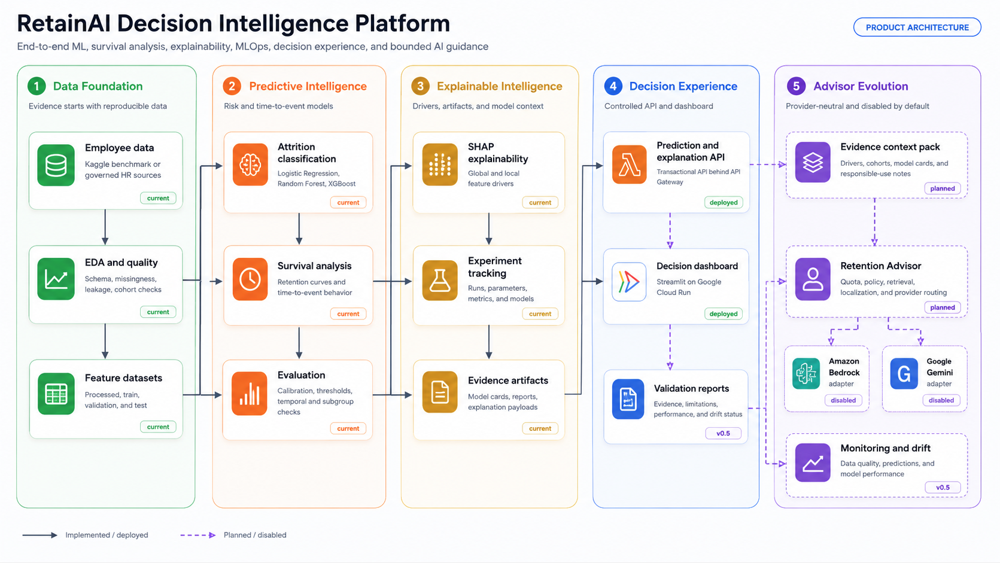
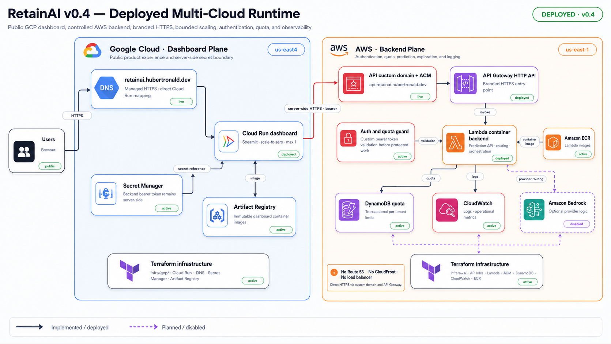
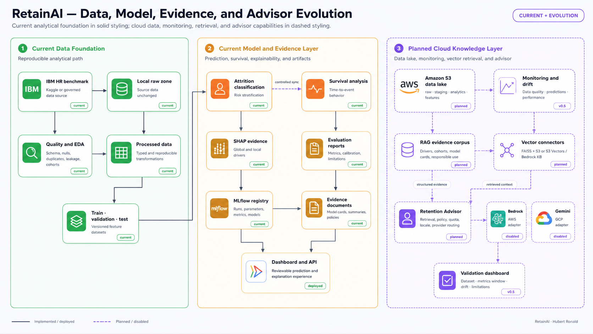
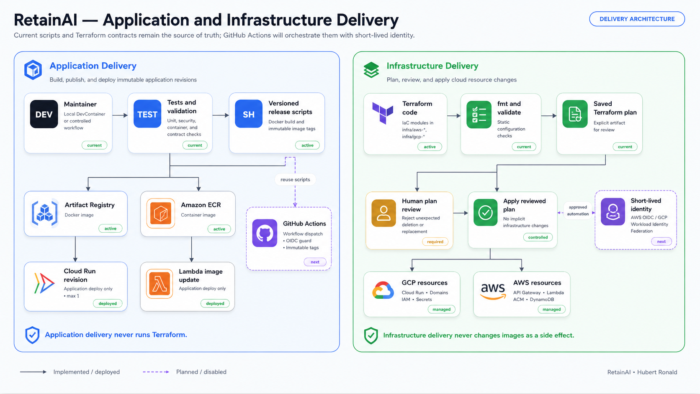
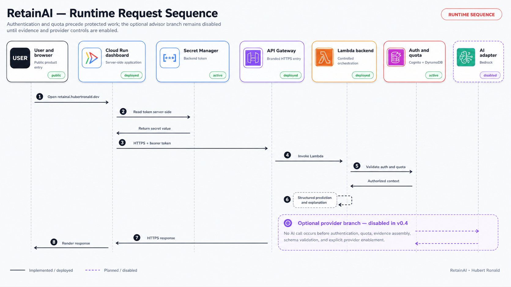

# RetainAI Architecture

<!-- retainai-architecture-gallery:start -->

## Architecture views

RetainAI uses multiple views because no single image can explain the product,
analytical lifecycle, runtime topology, delivery model, and request sequence
without becoming unreadable.

| View | Purpose | Status |
|---|---|---|
| Decision Intelligence | Product and analytical capabilities | Current foundation + planned evolution |
| Multicloud runtime | GCP dashboard and AWS backend operating in `v0.4` | Deployed |
| Data, model, evidence, and advisor | Analytical lifecycle and governed RAG evolution | Current + planned |
| Delivery architecture | Application delivery versus Terraform infrastructure delivery | Current + next milestone |
| Runtime sequence | Authentication, quota, prediction, explanation, and optional AI flow | Current + disabled branch |

### Visual status convention

```text
solid border and connector
  implemented or deployed

dashed border and connector
  planned, disabled, or post-v0.4
```

## Decision-intelligence architecture

[](../../figs/retainai_decision_intelligence_architecture.svg)

## Current deployed multicloud runtime

[](../../figs/architecture/retainai_multicloud_runtime_v0_4.svg)

## Data, model, evidence, and advisor evolution

[](../../figs/architecture/retainai_data_model_evidence_pipeline.svg)

## Application and infrastructure delivery

[](../../figs/architecture/retainai_delivery_architecture.svg)

## Runtime request sequence

[](../../figs/architecture/retainai_runtime_sequence.svg)

<!-- retainai-architecture-gallery:end -->


This document is the canonical architecture guide for RetainAI.

It separates:

```text
product architecture
current deployed runtime
analytical and evidence lifecycle
future RAG and advisor evolution
application delivery
infrastructure delivery
runtime request sequence
```

## Table of contents

- [Architecture views](#architecture-views)
- [Status legend](#status-legend)
- [Decision-intelligence architecture](#decision-intelligence-architecture)
- [Current deployed multicloud runtime](#current-deployed-multicloud-runtime)
- [Current request flow](#current-request-flow)
- [Analytical foundation](#analytical-foundation)
- [Data, model, evidence, and RAG evolution](#data-model-evidence-and-rag-evolution)
- [Delivery architecture](#delivery-architecture)
- [Runtime sequence](#runtime-sequence)
- [Current and planned capabilities](#current-and-planned-capabilities)
- [Security boundaries](#security-boundaries)
- [Architecture decisions](#architecture-decisions)
- [Internationalization boundary](#internationalization-boundary)
- [Related guides](#related-guides)

## Architecture views

RetainAI uses several architecture views because no single diagram can
communicate the product, analytics, runtime, data lifecycle, and delivery model
without becoming unreadable.

| View | Purpose | README placement |
|---|---|---|
| Decision Intelligence | Explain the whole product and analytical layers | Root README and this guide |
| Multicloud runtime v0.4 | Show what is deployed and operating now | Root README and this guide |
| Data/model/evidence pipeline | Show current analytical foundation and future RAG path | This guide only |
| Delivery architecture | Separate application releases from infrastructure changes | This guide only |
| Runtime sequence | Show request, auth, quota, prediction, explanation, and optional AI flow | This guide only |

The root README intentionally contains only the first two visualizations. The
remaining views belong here to avoid turning the repository landing page into
an architecture report.

## Status legend

All diagrams use the following semantic distinction:

```text
solid line / solid border
  current implementation or deployed v0.4 runtime

dashed line / dashed border
  planned evolution, disabled capability, or post-v0.4 component
```

This prevents future RAG, monitoring, and provider capabilities from being
misread as already deployed.

## Decision-intelligence architecture

RetainAI is not only a multicloud application. Its product foundation combines:

```text
data preparation
exploratory analysis
classification
survival analysis
SHAP explainability
MLflow experiment tracking
model and explanation artifacts
FastAPI services
Streamlit decision support
future monitored and AI-assisted guidance
```

[](../../figs/retainai_decision_intelligence_architecture.svg)

[Editable source](https://github.com/HubertRonald/RetainAI/blob/v0.4.0-alpha.1/docs/architecture/diagrams/decision_intelligence.mmd)

### Product layers

| Layer | Responsibility |
|---|---|
| Data and analytical foundation | Prepare, validate, profile, and version inputs |
| Predictive intelligence | Classification and survival outputs |
| Explainable intelligence | SHAP, feature drivers, model cards, and evidence |
| Decision experience | API contracts, dashboard, reports, and review |
| MLOps and governance | Experiments, artifacts, monitoring, and release controls |
| Advisor layer | Optional evidence-grounded guidance through provider adapters |

## Current deployed multicloud runtime

The following architecture is deployed for `v0.4`.

[](../../figs/architecture/retainai_multicloud_runtime_v0_4.svg)

[Editable source](https://github.com/HubertRonald/RetainAI/blob/v0.4.0-alpha.1/docs/architecture/diagrams/multicloud_runtime_v0_4.mmd)

### GCP dashboard plane

```text
domain:
  retainai.hubertronald.dev

runtime:
  Google Cloud Run
  retainai-dashboard
  us-east4

image registry:
  Google Artifact Registry

secret:
  GCP Secret Manager

scaling:
  minimum instances = 0
  service maximum = 1
  revision maximum = 1
```

### AWS backend plane

```text
domain:
  api.retainai.hubertronald.dev

entry:
  API Gateway HTTP API

compute:
  AWS Lambda container
  us-east-1

image registry:
  Amazon ECR

quota:
  DynamoDB

logs:
  CloudWatch

certificate:
  AWS Certificate Manager
```

### Infrastructure plane

```text
infra/aws-terraform
infra/gcp-terraform
```

Terraform is the active infrastructure-as-code implementation.

Routine dashboard image releases do not apply Terraform.

## Current request flow

1. The user opens `retainai.hubertronald.dev`.
2. Cloud Run serves the Streamlit application.
3. Server-side dashboard code reads the backend bearer token from Secret
   Manager.
4. Cloud Run calls `api.retainai.hubertronald.dev`.
5. API Gateway invokes the Lambda container.
6. Lambda validates the bearer token.
7. Lambda evaluates the DynamoDB quota for protected endpoint groups.
8. Prediction or explanation services execute.
9. Lambda logs operational metadata and returns a structured response.
10. Streamlit renders the result.

AI providers remain disabled in `v0.4`.

## Analytical foundation

### Attrition classification

RetainAI supports supervised employee-attrition analysis through reusable model
pipelines and evaluation artifacts.

Representative model families include:

```text
logistic regression
random forest
XGBoost
```

### Survival analysis

Survival models add a time-to-event perspective that classification alone
cannot provide.

They support questions such as:

```text
How does retention probability change over time?
Which factors are associated with earlier attrition?
How should cohorts be compared across a time horizon?
```

### Explainability

Explainability is a first-class product layer:

```text
global feature importance
local employee-level drivers
SHAP artifacts
driver summaries
model cards
responsible-use notes
```

### Experiment and artifact tracking

MLflow and versioned artifacts preserve:

```text
parameters
metrics
model versions
explanation artifacts
reports
evaluation context
```

## Data, model, evidence, and RAG evolution

This view combines the current analytical foundation with the planned
evidence-retrieval and advisor path.

[](../../figs/architecture/retainai_data_model_evidence_pipeline.svg)

[Editable source](https://github.com/HubertRonald/RetainAI/blob/v0.4.0-alpha.1/docs/architecture/diagrams/data_model_evidence_pipeline.mmd)

### Current foundation

```text
Kaggle or governed HR data
local data zones
EDA and data-quality checks
processed and split datasets
classification and survival models
SHAP and evaluation artifacts
dashboard and API consumption
```

### Planned evolution

```text
S3 data lake contracts
model-evidence documents
FAISS + S3 connector
S3 Vectors or Bedrock Knowledge Base connector
provider-neutral Retention Advisor
Gemini and Bedrock adapters
monitoring and drift reports
```

### Evidence before generation

Raw SHAP objects should not be sent directly to an LLM.

RetainAI should generate structured evidence documents from:

```text
model cards
global driver summaries
local explanation payloads
survival summaries
validation reports
responsible-use policies
```

The advisor receives a bounded context pack derived from those documents.

## Delivery architecture

The delivery architecture separates application revisions from infrastructure
changes.

[](../../figs/architecture/retainai_delivery_architecture.svg)

[Editable source](https://github.com/HubertRonald/RetainAI/blob/v0.4.0-alpha.1/docs/architecture/diagrams/delivery_architecture.mmd)

### Current application delivery

```text
local or controlled operator command
  ↓
Docker build
  ↓
Artifact Registry or ECR
  ↓
Cloud Run revision or Lambda image update
```

Dashboard delivery uses:

```bash
IMAGE_TAG="<immutable-tag>" \
  ./scripts/deploy_dashboard_cloud_run.sh
```

### Current infrastructure delivery

```text
terraform fmt
terraform validate
terraform plan
human review
terraform apply reviewed plan
```

### Planned GitHub Actions evolution

The automation target should use:

```text
workflow_dispatch
main-branch guard
AWS OIDC
GCP Workload Identity Federation
immutable image tags
separate application and infrastructure jobs
explicit deployment approval
```

The future workflow should reproduce the existing scripts and Terraform
contracts rather than invent a parallel deployment path.

## Runtime sequence

[](../../figs/architecture/retainai_runtime_sequence.svg)

[Editable source](https://github.com/HubertRonald/RetainAI/blob/v0.4.0-alpha.1/docs/architecture/diagrams/runtime_sequence.mmd)

The sequence explicitly separates:

```text
public health
authenticated prediction
quota-controlled explanation
future AI advisor
```

The advisor branch is disabled by default and executes only after
authentication, quota, evidence assembly, and provider selection.

## Current and planned capabilities

| Capability | Status at v0.4 |
|---|---|
| Attrition classification | Implemented foundation |
| Survival analysis | Implemented foundation |
| SHAP explainability | Implemented foundation |
| MLflow tracking | Implemented foundation |
| Streamlit dashboard | Deployed |
| Branded dashboard domain | Deployed |
| API Gateway + Lambda backend | Deployed |
| Branded API domain | Deployed |
| Server-side bearer token | Deployed |
| DynamoDB quota | Deployed |
| Terraform AWS/GCP | Active |
| Decoupled dashboard delivery | Active |
| GitHub Actions cloud delivery | Next delivery milestone |
| Monitoring and drift | Planned for v0.5 |
| English/Spanish localization | Planned for v0.6 |
| Gemini adapter | Planned and disabled |
| Bedrock adapter | Planned and disabled |
| FAISS + S3 retrieval | Planned |
| S3 Vectors / Bedrock KB | Future managed option |
| Psychometric Intelligence | Research only, not committed |

## Security boundaries

```text
The browser never receives the backend bearer token.
The browser never receives Gemini or Bedrock credentials.
Cloud Run does not call AI providers directly.
API Gateway and Lambda form the controlled backend boundary.
Authentication is evaluated before protected execution.
Quota is evaluated before AI-backed execution.
Provider output must be schema-validated and evidence-aware.
Sensitive employee data must be minimized or redacted.
```

## Architectural principles and decisions

### RetainAI is a decision-intelligence platform

RetainAI combines predictive modeling, survival analysis, explainability,
experiment tracking, controlled API services, dashboard-driven decision support,
and an evolving advisor layer.

The multicloud topology provides the runtime and delivery foundation for these
capabilities, but it does not define the complete product scope.

### Terraform is the active infrastructure-as-code standard

AWS and Google Cloud infrastructure is managed through Terraform modules located
under:

```text
infra/aws-terraform
infra/gcp-terraform
```

Earlier Pulumi experiments are part of the repository history but are not part
of the active infrastructure architecture.

### The dashboard uses direct Cloud Run domain mapping

The public dashboard is exposed through a direct Cloud Run domain mapping at:

```text
retainai.hubertronald.dev
```

This approach provides managed HTTPS and an appropriate operational footprint
for the current product scale without introducing an external Google Cloud load
balancer.

### The backend uses an API Gateway regional custom domain

The AWS backend is exposed through:

```text
api.retainai.hubertronald.dev
```

The domain is implemented with API Gateway and AWS Certificate Manager. The
current architecture does not require Route 53, CloudFront, or an AWS load
balancer.

### Application delivery and infrastructure delivery are independent

Application releases build and deploy immutable container images without
applying Terraform.

Infrastructure changes follow a separate workflow based on formatting,
validation, a saved Terraform plan, human review, and application of the
reviewed plan.

This separation prevents routine application releases from modifying cloud
resources and prevents infrastructure changes from replacing application images
as a side effect.

### AI providers are implementation adapters

Google Gemini and Amazon Bedrock are optional implementations of a common
advisor-provider contract.

Authentication, quota enforcement, evidence assembly, policy controls,
localization, logging, and response validation remain part of RetainAI's backend
orchestration rather than provider-specific logic.

AI providers remain disabled by default.

### Current and planned capabilities are documented separately

Architecture diagrams use solid styling for implemented or deployed components
and dashed styling for planned, optional, or disabled components.

This convention applies to capabilities such as:

```text
monitoring and drift detection
vector retrieval
RAG evidence services
Gemini and Bedrock integrations
GitHub Actions delivery
governed automated retraining
```

The visual distinction prevents roadmap components from being interpreted as
part of the current production runtime.

## Internationalization boundary

Internationalization is an architectural concern, not only a translation task.

User-facing copy should move to:

```text
locales/en.json
locales/es.json
```

Backend explanations should prefer:

```json
{
  "message_key": "advisor.risk.high",
  "variables": {
    "risk_score": 0.81
  },
  "evidence": []
}
```

The dashboard renders localized prose from stable keys. Business logic,
evidence, and provider routing remain language-independent.

## Related guides

- [Documentation index](../)
- [Dashboard](../dashboard/)
- [Data](../data/)
- [EDA](../eda/)
- [Modeling](../modeling/)
- [MLOps](../mlops/)
- [Multicloud delivery](../multicloud/)
- [Prompt engineering](../prompts/)
