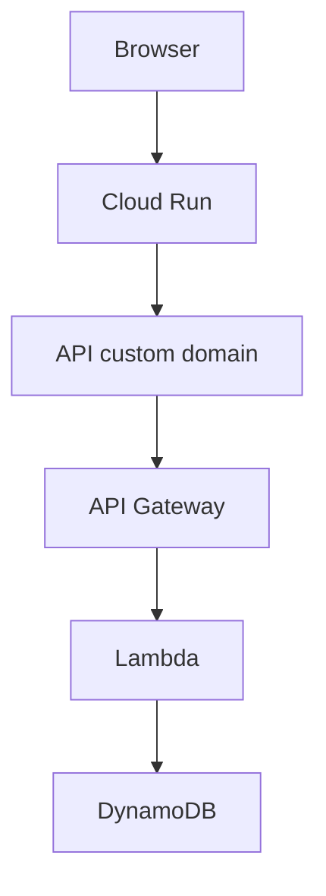

# Multicloud Delivery

## Table of contents

- [Topology](#topology)
- [Domains](#domains)
- [GCP dashboard](#gcp-dashboard)
- [AWS backend](#aws-backend)
- [Authentication and quota](#authentication-and-quota)
- [Infrastructure as code](#infrastructure-as-code)
- [Application delivery](#application-delivery)
- [Cost controls](#cost-controls)
- [Operational validation](#operational-validation)

## Topology



## Domains

```text
retainai.hubertronald.dev
  → Cloud Run direct domain mapping

api.retainai.hubertronald.dev
  → API Gateway Regional custom domain
```

## GCP dashboard

```text
project: coplayground
region: us-east4
service: retainai-dashboard
Artifact Registry: retainai-dashboard
secret: retainai-backend-token
```

No external GCP load balancer is used.

## AWS backend

```text
region: us-east-1
API Gateway HTTP API
Lambda container
ECR repository
DynamoDB quota table
ACM certificate
```

No Route 53, CloudFront, or AWS load balancer is required.

## Authentication and quota

```text
Cloud Run reads token from Secret Manager
Cloud Run sends token server-side
Lambda validates token
DynamoDB enforces quota
AI remains disabled by default
```

## Infrastructure as code

Terraform is the only active IaC implementation:

```text
infra/aws-terraform
infra/gcp-terraform
```

Pulumi is not part of the current architecture.

## Application delivery

Dashboard:

```bash
IMAGE_TAG="<immutable-tag>"   ./scripts/deploy_dashboard_cloud_run.sh
```

Infrastructure:

```bash
terraform plan -out=/tmp/reviewed.tfplan
terraform apply /tmp/reviewed.tfplan
```

Routine image delivery must not apply Terraform.

## Cost controls

```text
Cloud Run minimum = 0
Cloud Run service maximum = 1
Cloud Run revision maximum = 1
Lambda request-driven
AI disabled
quota enabled
```

## Operational validation

```bash
curl -sS https://api.retainai.hubertronald.dev/health
dig +short CNAME retainai.hubertronald.dev
dig +short CNAME api.retainai.hubertronald.dev
```

## Related guides

- [Architecture](../architecture/)
- [Dashboard](../dashboard/)
- [MLOps](../mlops/)
- [Documentation index](../)

<!-- retainai-manual-release:start -->
## Manual application promotion

RetainAI uses a manually dispatched GitHub Actions workflow to promote immutable
dashboard and backend images from the protected `main` branch.

The workflow evaluates component-specific build inputs before cloud
authentication. Documentation, diagrams, Markdown, and other non-runtime changes
do not qualify by themselves.

AWS authentication uses GitHub OIDC. Google Cloud authentication uses Workload
Identity Federation. Long-lived AWS keys and Google service-account key files
are not used.

Application releases update only Cloud Run and Lambda image references. They do
not run Terraform, manage S3, or recreate infrastructure.

See
[Manual multi-cloud application release](./manual_application_release)
for the complete operating contract.
<!-- retainai-manual-release:end -->
