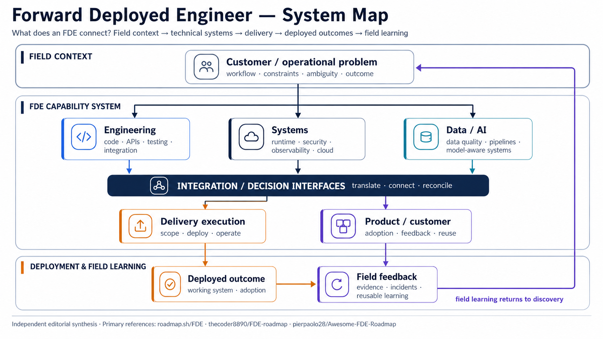
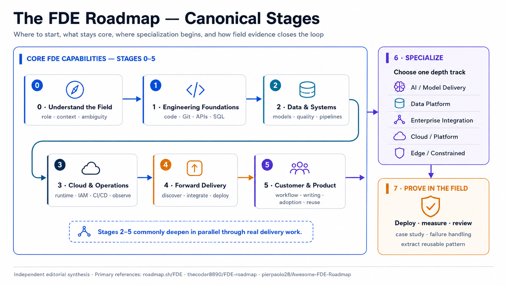
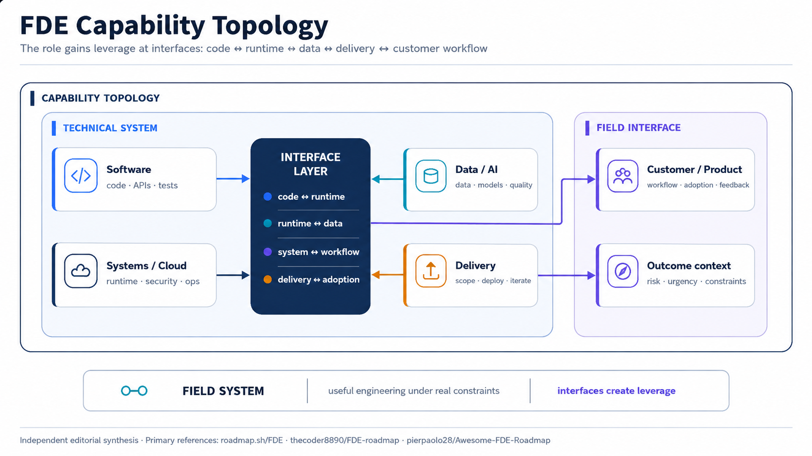
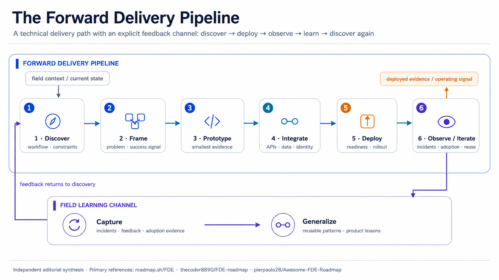
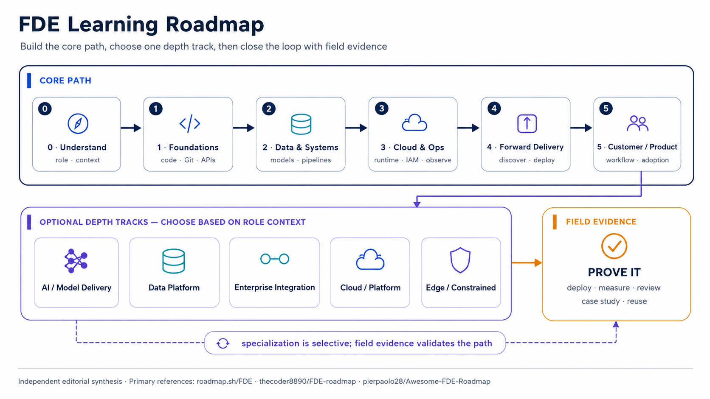
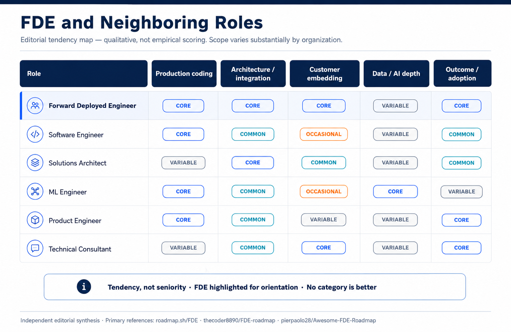
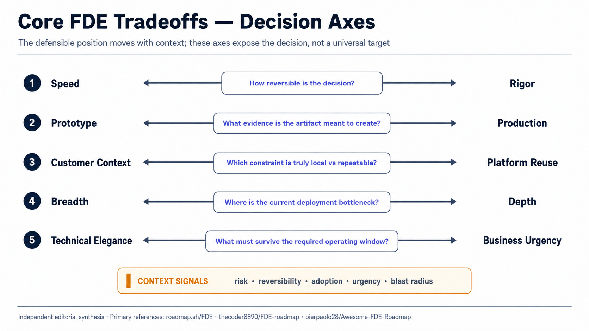

# Forward Deployed Engineer Roadmap

  
  
  
  
  

> **Independent Visual Field Guide**
> An independent visual field guide to Forward Deployed Engineering.

A practical roadmap for building the engineering judgment, delivery habits, and role-specific depth used in Forward Deployed Engineering.

> **Sources & provenance:** This roadmap is an independent synthesis of a defined public source corpus. See [Sources & Provenance](./reference/sources-and-provenance) for references, source snapshots, licenses, attribution boundaries, and source mapping.

## Why This Guide Exists

The label **Forward Deployed Engineer (FDE)** spans meaningfully different roles. Some positions are software-heavy; some center on AI delivery or data platforms; others emphasize enterprise integration, cloud operations, or constrained field environments.

A single vendor stack or giant tool checklist therefore creates false precision.

This guide uses a more durable question:

> **Can you turn an ambiguous real-world problem into a working system, deploy it under actual constraints, create adoption, and convert field learning into reusable engineering patterns?**

Use this repository as a:

- roadmap for independent study;
- conceptual orientation to the role;
- project and capstone planning aid;
- role-comparison lens;
- vocabulary for customer-facing technical delivery.

## What Is Forward Deployed Engineering?

A practical working interpretation is:

**Forward Deployed Engineering is production-oriented engineering performed close to users, workflows, and deployment constraints, with responsibility for translating ambiguous needs into deployed systems and for carrying field feedback back into the product or platform.**

The exact boundary changes by employer. A role may lean toward application engineering, AI systems, data infrastructure, enterprise integration, cloud/platform work, or field deployment. The guide therefore distinguishes **core FDE capabilities** from **role-specific depth tracks**.

The system map below summarizes the interfaces the role commonly connects: field context, engineering systems, delivery, product/customer context, deployed outcomes, and field learning.

## The FDE Roadmap

This is the canonical roadmap for the guide.

The roadmap has three layers:

- **Stages 0–5 — Core FDE capabilities:** durable foundations and delivery behaviors that recur across FDE-oriented work.
- **Stage 6 — Role-specific depth:** choose the specialization that matches the deployment context; do not attempt to master every track.
- **Stage 7 — Proof in the field:** demonstrate the capabilities through a deployed system and evidence of learning.

It is a progression, not a rigid prerequisite graph. After the engineering foundations, Stages 2–5 often develop in parallel through real projects.

---

### 0 — Understand the Field

Learn the operating context before collecting tools.

**Focus**

- role mission and role variability;
- customer and user context;
- ambiguous problem spaces;
- workflow and constraint discovery;
- outcome ownership;
- difference between a demo, a deployment, and durable adoption.

**Evidence to produce:** a one-page role/problem brief that names users, workflow, constraints, success signal, and what the engineer owns.

---

### 1 — Engineering Foundations

Build the minimum engineering base required to change and ship real systems safely.

**Focus**

- one general-purpose programming language used confidently;
- Git and command-line workflows;
- HTTP, APIs, and service boundaries;
- SQL plus basic data modeling;
- testing and debugging;
- error handling and maintainability;
- basic frontend/backend integration when required to close a workflow.

**Evidence to produce:** a small end-to-end service with tests, clear setup, an API boundary, and persistent data.

---

### 2 — Data & Systems Foundations

Learn to reason across boundaries rather than inside a single application process.

**Focus**

- schemas, contracts, and data quality;
- storage and pipeline concepts;
- batch and event-driven flows;
- integration boundaries and failure modes;
- distributed-system awareness;
- consistency, retries, idempotency, and back-pressure at a practical level;
- lineage and privacy awareness where data sensitivity requires it.

**Evidence to produce:** an integration that moves or synchronizes data across at least two system boundaries, with validation and failure handling.

---

### 3 — Cloud, Security & Operations

Treat deployment and operations as part of the engineering problem.

**Focus**

- containers and reproducible runtime packaging;
- cloud fundamentals without binding the core roadmap to one provider;
- identity, IAM, secrets, and least privilege;
- networking fundamentals;
- infrastructure as code;
- CI/CD and environment promotion;
- logs, metrics, traces, and health signals;
- incident and root-cause thinking;
- reliability, cost, and operational tradeoffs.

**Evidence to produce:** a reproducibly deployed environment with access controls, observability, a runbook, and one tested recovery path.

**Vendor-neutrality note:** AWS, Google Cloud, Azure, and other platforms are examples of implementation environments—not canonical FDE requirements.

---

### 4 — Forward Delivery

Learn the field loop that converts uncertainty into deployment evidence.

**Focus**

- discovery and current-state mapping;
- problem framing and success criteria;
- scope control and prototype boundaries;
- architecture and integration decisions;
- staged deployment and rollout;
- runbooks, handoff, and ownership boundaries;
- adoption and post-deployment feedback;
- iteration based on evidence rather than assumption.

**Evidence to produce:** a delivery packet containing the problem frame, decision record, rollout plan, operational notes, and post-deployment review.

---

### 5 — Product & Customer Fluency

Build the communication and product judgment needed to make technical delivery useful.

**Focus**

- stakeholder mapping;
- workflow understanding;
- requirement translation;
- tradeoff communication;
- concise technical writing;
- expectation management;
- feedback loops and adoption signals;
- identifying repeated field patterns that should become reusable product or platform capabilities.

**Evidence to produce:** a short stakeholder update plus a product-feedback note that connects a field observation to a reusable change.

---

### 6 — Choose a Depth Track

Once the core is credible, develop depth where your target FDE role places its hardest deployment constraints.

This is **specialization**, not universal core. See [Choose a Depth Track](#choose-a-depth-track) below.

---

### 7 — Prove It in the Field

Convert the roadmap into evidence.

**Focus**

- one capstone grounded in a user workflow;
- real deployment rather than notebook-only completion;
- integration across multiple boundaries;
- failure handling and observability;
- a defined outcome or success signal;
- a case study or implementation narrative;
- a post-deployment review;
- one reusable pattern extracted from the project.

**Evidence to produce:** a repository or case study that lets another engineer understand the problem, architecture, deployment, operating model, observed result, and lessons learned.

## Core Capability Pillars

The stages describe progression; the pillars describe the **cross-cutting capabilities** exercised throughout it.

| Pillar | Practical interpretation |
|---|---|
| **Software Engineering** | Build, test, debug, integrate, and maintain production code. |
| **Systems & Cloud** | Understand runtime environments, architecture, security, observability, and operations. |
| **Data / AI** | Reason about data quality, pipelines, evaluation, and model-aware systems when the role needs them. |
| **Delivery & Execution** | Scope, prototype deliberately, integrate, deploy, troubleshoot, and iterate. |
| **Customer / Product** | Discover the real workflow, communicate tradeoffs, support adoption, and feed recurring patterns back into product decisions. |

These labels are an editorial organizing device for recurring capabilities rather than a universal industry standard.

## Choose a Depth Track

Not every FDE needs the same technical depth. Pick **one primary track** first; add a second only when your actual deployment context demands it.

| Depth track | Go deeper on | Typical evidence |
|---|---|---|
| **AI / Model Delivery** | model/LLM integration, evaluation, retrieval, latency/cost, guardrails, model operations | evaluated AI feature deployed behind a real application boundary |
| **Data Platform** | pipelines, distributed processing, orchestration, quality, lineage, storage design | observable data product or pipeline with explicit contracts |
| **Enterprise Workflow / Integration** | APIs, identity, legacy systems, workflow automation, data contracts | end-to-end enterprise integration with operational handoff |
| **Cloud / Platform** | infrastructure, networking, security, deployment platforms, developer experience | reusable deployment path or platform capability |
| **Edge / Tactical / Constrained Environment** | offline/limited connectivity, hardware/environment constraints, packaging, secure local operations | resilient deployment tested under stated constraints |

The edge/constrained track is intentionally optional and represents a narrower field-oriented specialization rather than universal FDE core.

**Vendor rule:** learn one platform deeply enough to ship, but express the architecture in provider-neutral concepts. Examples may use AWS, Google Cloud, or Azure without elevating any of them into the FDE definition.

## The Forward Delivery Loop

The roadmap's delivery stage is easiest to remember as a recurring operating loop:

**Discover → Frame → Prototype → Integrate → Deploy → Iterate**

- **Discover** — map workflows, constraints, stakeholders, existing systems, and failure points.
- **Frame** — define the problem, success signal, scope boundary, assumptions, and known risks.
- **Prototype** — create the smallest solution that can produce useful evidence.
- **Integrate** — connect data, identity, APIs, environments, and operational dependencies.
- **Deploy** — harden what matters, roll out intentionally, and observe real behavior.
- **Iterate** — use adoption, incidents, feedback, and measured outcomes to improve the solution and identify reusable patterns.

Discovery and iteration recur throughout real delivery rather than occurring only once.

## Learning Progression

The learning view translates the canonical stages into a study route: build the **Core Path**, choose a role-specific **Depth Track**, then validate the route through **Field Evidence**.

Use the path as sequencing guidance rather than a rigid prerequisite chain. Stages 2–5 usually deepen together through real projects, while specialization remains selective. Prefer artifact-producing projects over isolated tool collection.

## Role Comparison

FDE overlaps with neighboring roles, and titles vary widely by company. The comparison is deliberately qualitative.

The visual uses **Core / Common / Variable / Occasional** as editorial tendency labels. They are not empirical scores, labor-market measurements, or universal job definitions.

A recurring FDE combination is meaningful production engineering + architecture/integration + customer context + delivery ownership. Software Engineers, Solutions Architects, ML Engineers, Product Engineers, and Technical Consultants may overlap substantially depending on the organization.

## Core Tradeoffs

Forward deployment repeatedly creates situations where both sides are valuable.

- **Speed vs. rigor** — create evidence quickly; increase rigor as blast radius and irreversibility grow.
- **Prototype vs. production** — prototypes answer questions; production systems must survive ownership, change, failure, and real users.
- **Customer context vs. platform reuse** — honor local constraints while looking for patterns that should not remain one-offs.
- **Breadth vs. depth** — navigate broadly, then go deep at the deployment bottleneck.
- **Technical elegance vs. business urgency** — prefer architecture that is simple enough to ship and strong enough for the required operating conditions.

These axes are an editorial decision framework, not a measured model or a claim that one operating point is universally correct.

## Practical Capstone Pattern

Use a capstone to test whether the roadmap has become operational skill.

1. Start from a written user workflow, not a preferred technology.
2. Define a success signal before implementation is complete.
3. Integrate at least two system or data boundaries.
4. Include authentication, authorization, or another realistic access constraint.
5. Deploy to an actual runtime.
6. Add logs, a health signal, and one explicit failure-recovery path.
7. Write at least one architecture or tradeoff decision record.
8. Produce a runbook or handoff note.
9. Perform a post-deployment review.
10. Extract one reusable component, pattern, or product lesson.

The goal is not maximal complexity. The goal is **credible evidence of end-to-end judgment**.

## Visual Guide

| Visual | Purpose |
|---|---|
| [Roadmap stages](./assets/fde-roadmap-stages.png) | Canonical eight-stage roadmap: core → specialize → prove. |
| [System map](./assets/fde-roadmap-overview.png) | Shows how field context, technical domains, delivery, outcomes, and feedback connect. |
| [Capability topology](./assets/fde-skill-pillars.png) | Shows FDE leverage at interfaces between technical and field domains. |
| [Delivery pipeline](./assets/fde-delivery-loop.png) | Shows the discover → deploy path plus an explicit field-learning return channel. |
| [Learning roadmap](./assets/fde-learning-path.png) | Separates the core path, optional depth tracks, and proof through field evidence. |
| [Role comparison](./assets/fde-role-comparison.png) | Qualitative comparison with neighboring roles; no numerical scoring. |
| [Decision axes](./assets/fde-core-tradeoffs.png) | Frames recurring tensions without implying a measured or universally correct operating point. |

The seven diagrams currently checked in under `src/img/` are the accepted final visual set for v0.1.0. Their production provider and production method are not asserted by this repository; conceptual FDE claims remain attributed to the primary source corpus.

## How to Use This Repo

**Exploring the role?** Start with the roadmap stages, role comparison, and tradeoffs.

**Preparing for FDE-style work?** Audit one current project against Stages 0–5 and the delivery loop.

**Choosing what to study next?** Identify the earliest weak core stage, then choose one depth track.

**Reading a job description?** Separate core responsibilities from employer-specific depth before judging fit.

**Building a portfolio?** Use Stage 7 and the capstone checklist to turn implementation work into evidence.

## Contributing

Contributions are welcome when they improve clarity, provenance, role nuance, or usefulness without turning the guide into an exhaustive link list.

See [`CONTRIBUTING.md`](./reference/contributing).

## Sources, Citation & Attribution

This roadmap is an independent synthesis of a defined public source corpus. Detailed references, source snapshots, licenses, attribution boundaries, and the source map live in [Sources & Provenance](./reference/sources-and-provenance).

For citation guidance, see [`CITATION.md`](./reference/citation). Machine-readable source metadata is available in [`SOURCES.yml`](https://github.com/HubertRonald/fde-roadmap/blob/f896c19d182f8df03918f2c73a402e27a80ded16/SOURCES.yml).

## License

Original project expression is licensed under **Creative Commons Attribution 4.0 International (CC BY 4.0)**. See [`LICENSE`](https://github.com/HubertRonald/fde-roadmap/blob/f896c19d182f8df03918f2c73a402e27a80ded16/LICENSE).

The license does **not** relicense third-party repositories, linked website content, trademarks, or source material, and it does not claim ownership of the underlying ideas synthesized from the source corpus.

Canonical repository: <https://github.com/HubertRonald/fde-roadmap>

## Product Credit

Designed, curated, and built with ♥ and AI assistance by [Hubert Ronald](https://hubertronald.dev/).

The seven currently checked-in visual diagrams are the accepted final visual set for v0.1.0.
