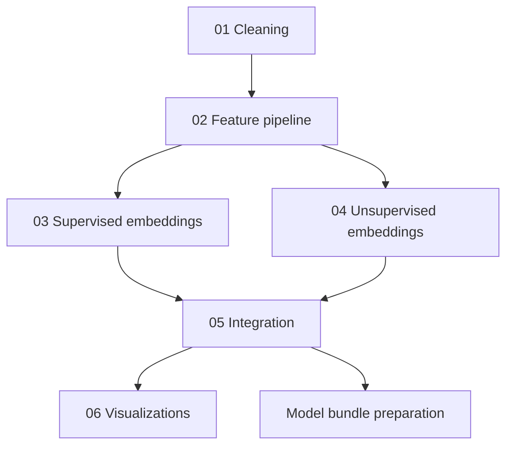

# Analytical Pipeline

VersoVector currently uses a notebook-first analytical workflow.

The notebooks establish the modeling logic before it is converted into reusable scripts, services, and deployable artifacts.

## Notebook sequence

| Notebook | Purpose |
|---|---|
| `01_cleaning_pipeline.ipynb` | Cleans raw datasets, normalizes metadata, creates stable poem identifiers, and generates processed corpora |
| `02_feature_pipeline.ipynb` | Fits the shared feature pipeline and transforms external poems |
| `03_embeddings_supervised.ipynb` | Trains supervised multilabel tag prediction models |
| `04_embeddings_unsupervised.ipynb` | Generates similarity, topics, clustering, and projection artifacts |
| `05_supervised_unsupervised_integration.ipynb` | Integrates supervised predictions with unsupervised outputs |
| `06_visualizations.ipynb` | Produces final visualizations from integrated artifacts |

## Pipeline flow

## Feature representation

The project uses classic NLP feature representations such as:

- count-based features;
- TF-IDF features;
- custom dictionary-like features;
- normalized sparse matrices.

A sparse-first design helps avoid unnecessary memory expansion.

Dense matrices are introduced only when required by downstream algorithms after dimensionality reduction or projection.

## Supervised branch

The supervised branch predicts multilabel poetic tags.

It is designed to support emotional or thematic classification, making the output interpretable for users and product demos.

## Unsupervised branch

The unsupervised branch supports:

- cosine similarity;
- nearest-neighbor search;
- LDA topic modeling;
- KMeans clustering;
- Gaussian Mixture Model clustering;
- exploratory clustering variants;
- UMAP or t-SNE projections.

## Integration layer

The integration step combines:

- supervised tags;
- unsupervised similarity;
- topic information;
- cluster assignments;
- visualization metadata.

This integrated output is what makes the project product-oriented rather than just experimental.