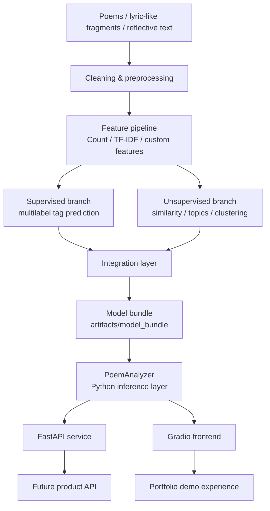
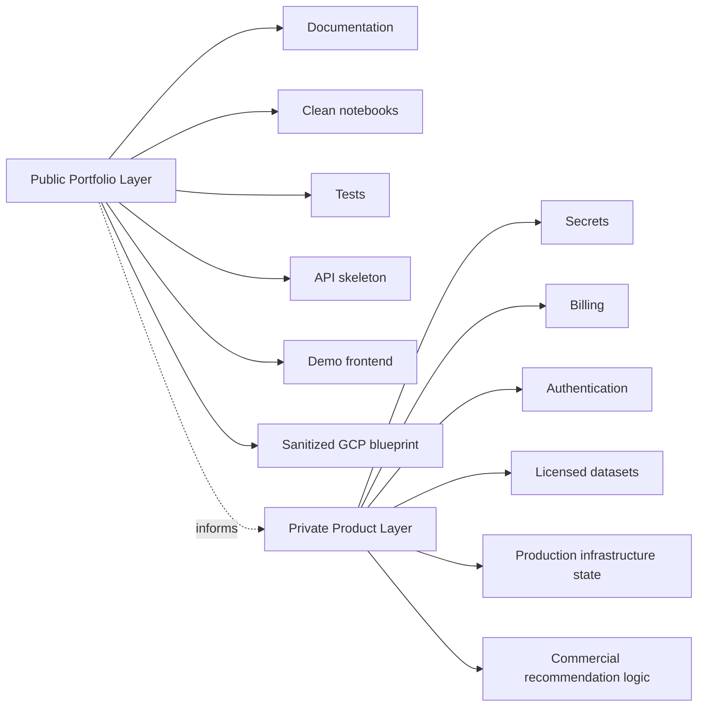

# Architecture

VersoVector is organized as a layered NLP/MLOps system.

The public repository shows the technical foundation without exposing production-only configuration.

## High-level architecture



## Repository layers

```text
VersoVector/
├── apps/
│   └── frontend/
├── artifacts/
├── configs/
├── data/
├── docs/
├── figs/
├── infra/
│   └── gcp-cloud-run-blueprint/
├── modules/
├── notebook/
├── services/
│   ├── api/
│   ├── frontend/
│   └── compose.yaml
├── src/
│   └── versovector/
├── tests/
└── utils/
```

## Main responsibilities

| Layer | Responsibility |
|---|---|
| `notebook/` | Exploratory and analytical pipeline |
| `modules/` | Reusable analytical components |
| `src/versovector/training/` | Scripted training and artifact generation |
| `src/versovector/inference/` | Model bundle loading and inference |
| `src/versovector/api/` | FastAPI serving layer |
| `apps/frontend/` | Gradio user-facing demo |
| `services/` | Local Dockerized API and frontend services |
| `infra/gcp-cloud-run-blueprint/` | Sanitized Google Cloud deployment blueprint |
| `tests/` | Unit and integration testing |

## Public architecture boundary



## Design principles

- Keep training and inference separated.
- Avoid retraining inside the serving layer.
- Package trained artifacts into a model bundle.
- Keep public infrastructure examples sanitized.
- Keep copyrighted or licensed content out of the public repository unless redistribution is allowed.
- Use the public repo as a credible technical portfolio, not as the full production product.