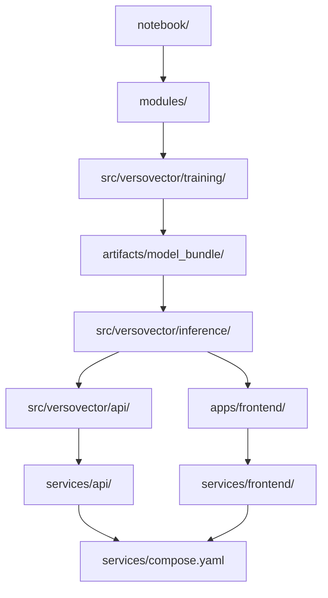

# Architecture

VersoVector is organized as a layered NLP/MLOps repository.

It starts with notebooks for experimentation and moves toward reproducible scripts, model bundles, inference, API serving, and frontend demos.

## Repository layers

```text
VersoVector/
├── apps/
│   └── frontend/
├── artifacts/
├── configs/
├── data/
├── docs/
├── figs/
├── infra/
├── modules/
├── notebook/
├── services/
├── src/
│   └── versovector/
├── tests/
└── utils/
```

## Layer responsibility

| Layer | Responsibility |
|---|---|
| `notebook/` | Exploratory pipeline, validation, and visual analysis |
| `modules/` | Reusable analytical logic shared by notebooks and scripts |
| `src/versovector/training/` | Scripted training and artifact generation |
| `src/versovector/inference/` | Model bundle loading and local inference |
| `src/versovector/api/` | FastAPI layer exposing inference operations |
| `apps/frontend/` | Gradio frontend foundation |
| `services/` | Dockerized API and frontend service packaging |
| `configs/` | Model and pipeline configuration |
| `artifacts/` | Locally generated artifacts ignored by Git |
| `tests/` | Automated tests |

## Package-level architecture



## Training package

The training package is the scriptable counterpart of the notebooks.

```text
src/versovector/training/
├── build_dataset.py
├── train_features.py
├── train_supervised.py
├── train_unsupervised.py
├── register_model.py
└── mlflow_utils.py
```

## Inference package

The inference package loads generated artifacts and exposes reusable analysis logic.

```text
src/versovector/inference/
├── artifact_loader.py
├── poem_analyzer.py
├── schemas.py
├── similarity_search.py
├── tag_predictor.py
└── topic_clusterer.py
```

## API package

The API package exposes the inference layer through FastAPI.

```text
src/versovector/api/
├── dependencies.py
├── main.py
├── schemas.py
└── settings.py
```

## Model bundle contract

The model bundle is the contract between training and inference.

```text
artifacts/model_bundle/
├── model_config.toml
├── model_metadata.json
├── feature_pipeline.joblib
├── supervised_classifier.joblib
├── multilabel_binarizer.joblib
├── nearest_neighbors.joblib
├── reference_metadata.csv
├── lda_model.joblib
├── lda_count_vectorizer.joblib
├── dimensionality_reducer.joblib
├── kmeans_model.joblib
├── gmm_model.joblib
├── lda_topics.csv
├── supervised_metrics.csv
└── unsupervised_metadata.json
```

## Design principle

The serving layer should not retrain models.

Training produces a model bundle.
Inference loads the model bundle.
API and frontend expose the inference behavior.