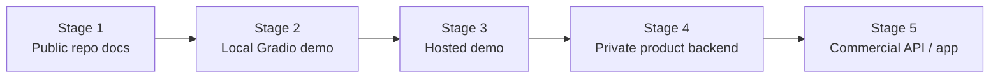

# Demo Roadmap

VersoVector's public documentation should prepare users for a future product demo without promising that the production application is already available.

## Current state

The public repository demonstrates:

- analytical notebooks;
- reusable modules;
- model bundle direction;
- API foundation;
- frontend foundation;
- Docker services;
- tests;
- sanitized deployment blueprint.

## Future public demo

A future demo may expose:

- text analysis;
- emotional tag prediction;
- semantic similarity explanation;
- topic signals;
- cluster interpretation;
- visual projection metadata;
- curated recommendations.

## Demo URL placeholder

When the demo is ready, this page can point to:

```text
https://versovector.hubertronald.dev/
```

or:

```text
https://hubertronald.dev/versovector/
```

The API may later live under:

```text
https://api.versovector.hubertronald.dev/
```

## Demo maturity stages



## Stage 1 — Public documentation

- Explain architecture.
- Document notebooks.
- Describe public/private boundary.
- Show safe static outputs.
- Link to GitHub repository.

## Stage 2 — Local demo

- Run API locally.
- Run Gradio locally.
- Use synthetic, public-domain, or user-provided text.
- Avoid storing user input in the public version.

## Stage 3 — Hosted demo

- Deploy a curated demo.
- Add usage limits.
- Use safe sample texts.
- Avoid full copyrighted lyrics.
- Add disclaimers and content boundaries.

## Stage 4 — Private product backend

- Add authentication.
- Add private model artifacts.
- Add monitoring.
- Add analytics.
- Add secure storage.
- Add licensed datasets if needed.

## Stage 5 — Product/API

- Expose stable endpoints.
- Add billing or access tiers.
- Add B2B connectors.
- Add product analytics.
- Add recommendation APIs.