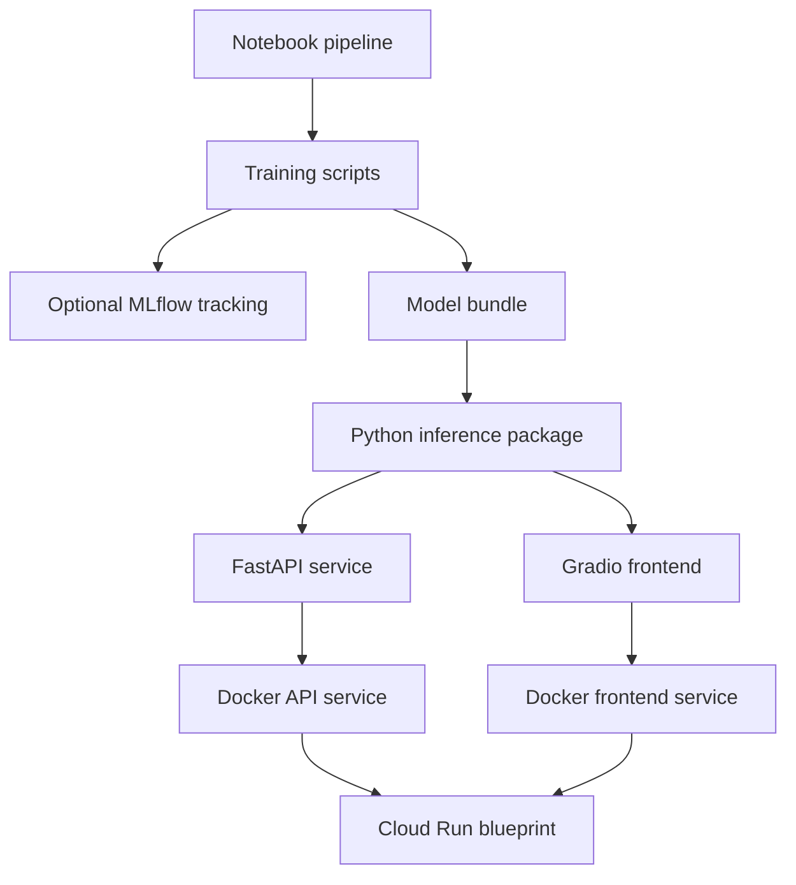

# MLOps & Serving

The MLOps direction of VersoVector is to move from exploratory notebooks into reproducible training, packaged artifacts, and serving layers.

## MLOps flow



## Training scripts

The scripted training layer is expected to map notebook logic into reproducible commands.

Example responsibilities:

| Script area | Responsibility |
|---|---|
| Dataset build | Build processed corpora |
| Feature training | Fit and serialize the feature pipeline |
| Supervised training | Train multilabel prediction models |
| Unsupervised training | Generate similarity, topic, cluster, and projection artifacts |
| Model registration | Package the model bundle |

## Model bundle

The serving layer should consume generated artifacts from:

```text
artifacts/model_bundle/
```

The API and frontend should not retrain models.

They should load packaged artifacts and expose analysis functions.

## Inference layer

The inference layer should provide a reusable Python abstraction such as:

```text
PoemAnalyzer
```

Its responsibility is to load the model bundle and return structured analysis results.

## API layer

The FastAPI layer should expose the inference capabilities through HTTP endpoints.

In the public repository, this remains a portfolio-safe serving foundation.

In production, the API may later include:

- authentication;
- rate limits;
- billing integration;
- user-specific history;
- analytics;
- private endpoints;
- secured model storage.

## Frontend layer

The Gradio frontend should demonstrate the user-facing analysis experience.

For the public repository, the frontend should remain a clear technical demo.

For the future product, the frontend can evolve into a richer app experience with:

- saved analyses;
- curated recommendations;
- visual exploration;
- product onboarding;
- user accounts;
- premium features.

## Deployment layer

The public repository may include a sanitized Cloud Run deployment blueprint.

Production deployment values, secrets, billing, IAM bindings, and infrastructure state should remain private.