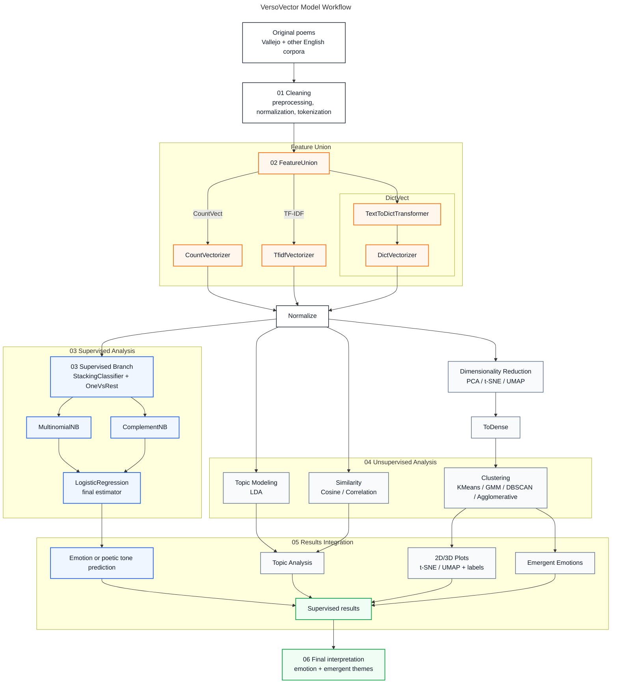

# Model Topology

This page explains how the models used in VersoVector are connected across the notebook pipeline.

The topology is based on the public repository documentation in `docs/model_topology.md` and connects the conceptual ML workflow with the executable notebooks.

## Project question

VersoVector explores the relationship between the semantic and emotional meaning of poetry through modern NLP and machine learning workflows.

It combines two learning approaches:

- **Unsupervised learning**: clustering poems by style, tone, topic, or semantic proximity.
- **Supervised learning**: classifying poems by emotion, theme, or poetic tone.

The project seeks to answer:

> Can a language model perceive the emotion behind a poem, as a human reader does?

## Notebook-to-model map

| Notebook | Main responsibility | Topology stage |
|---|---|---|
| `01_cleaning_pipeline.ipynb` | Cleans poems, normalizes text, prepares processed datasets | Original poems → preprocessing |
| `02_feature_pipeline.ipynb` | Builds the shared feature representation | FeatureUnion, CountVectorizer, TF-IDF, DictVectorizer, Normalize |
| `03_embeddings_supervised.ipynb` | Trains supervised multilabel models | StackingClassifier, OneVsRest, Naive Bayes, Logistic Regression |
| `04_embeddings_unsupervised.ipynb` | Builds unsupervised analysis | Clustering, LDA topics, cosine/correlation similarity, projections |
| `05_supervised_unsupervised_integration.ipynb` | Integrates both branches | Supervised + unsupervised results integration |
| `06_visualizations.ipynb` | Produces final interpretation figures | 2D/3D plots, labels, interpretation assets |

## General model workflow



## Stage 1 — Cleaning

Implemented mainly in:

```text
notebook/01_cleaning_pipeline.ipynb
```

This stage prepares raw poems and metadata for modeling.

Typical responsibilities:

- normalize text;
- clean punctuation or formatting noise;
- prepare tokenization;
- build stable poem identifiers;
- generate processed datasets.

## Stage 2 — Feature representation

Implemented mainly in:

```text
notebook/02_feature_pipeline.ipynb
```

The project builds a combined representation using `FeatureUnion`.

The feature union combines:

- `CountVectorizer`;
- `TfidfVectorizer`;
- custom dictionary features through `TextToDictTransformer`;
- `DictVectorizer`;
- normalization.

This stage produces the shared representation used by both supervised and unsupervised branches.

## Stage 3 — Supervised branch

Implemented mainly in:

```text
notebook/03_embeddings_supervised.ipynb
```

The supervised branch predicts emotion, theme, or poetic tone labels.

The topology includes:

- `OneVsRest`;
- `StackingClassifier`;
- `MultinomialNB`;
- `ComplementNB`;
- `LogisticRegression` as final estimator.

This branch gives names to the patterns learned from labeled examples.

## Stage 4 — Unsupervised branch

Implemented mainly in:

```text
notebook/04_embeddings_unsupervised.ipynb
```

The unsupervised branch discovers emergent relationships without relying only on previous labels.

It includes:

- clustering with `KMeans`, `GaussianMixture`, `DBSCAN`, and `AgglomerativeClustering`;
- topic modeling with `LatentDirichletAllocation`;
- similarity search with cosine similarity and correlation;
- dimensionality reduction or projections using PCA, t-SNE, or UMAP.

> Note: UMAP and t-SNE are dimensionality reduction methods, not clustering algorithms.

> Note: LDA needs an interpretable document-term matrix, so it uses an independent count-based or TF-IDF representation.

## Stage 5 — Results integration

Implemented mainly in:

```text
notebook/05_supervised_unsupervised_integration.ipynb
```

This stage connects what the model predicts with what the model discovers.

It integrates:

- predicted labels;
- clusters;
- topics;
- topic terms;
- semantic neighbors;
- projection coordinates.

Conceptually:

```text
Clustering + LDA + Similarity + Supervised classification
    ↓
Results integration
    ↓
Final interpretation: emotion + emergent themes
```

## Stage 6 — Visual interpretation

Implemented mainly in:

```text
notebook/06_visualizations.ipynb
```

The visualization stage helps interpret the combined results.

Useful outputs include:

- 2D/3D projections;
- cluster plots;
- topic charts;
- tag distributions;
- integrated result tables;
- nearest-neighbor examples.

## Why supervised and unsupervised models are combined

Poetry often blends emotions, symbols, and tones within the same text.

The unsupervised approach discovers emergent patterns through clustering, topics, and similarity.

The supervised approach predicts emotional or thematic labels from known categories.

Together, they make it possible to compare:

| Approach | Role |
|---|---|
| Clustering | Discovers emergent groups |
| Topic modeling | Suggests latent thematic structures |
| Similarity search | Finds semantic neighbors |
| Supervised classification | Assigns interpretable tags |
| Integration | Compares discovered patterns with predicted labels |

The unsupervised approach discovers resonances.
The supervised approach gives them names.

## Language note

Although the project was originally described in Spanish, the datasets and models are trained with poems in English because NLP resources are more available in English.