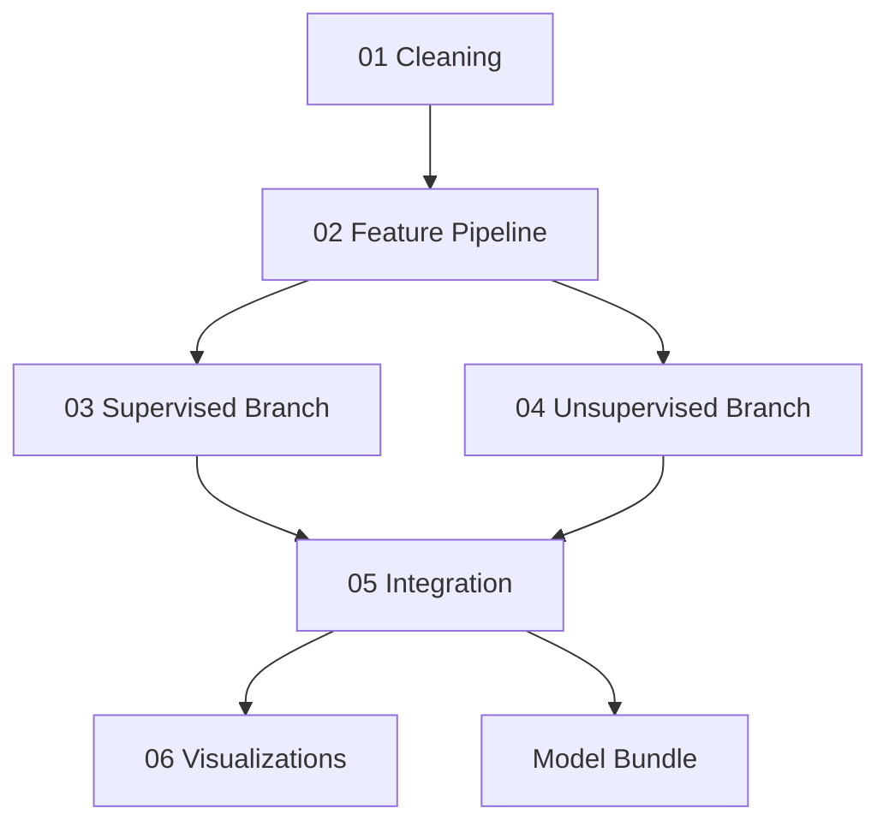

# Pipeline

VersoVector combines supervised and unsupervised NLP workflows.

For a visual explanation of how the modeling components connect across notebooks, see [Model Topology](./model-topology).

The goal is to produce an integrated analytical view of poetic text: predicted tags, semantic neighbors, topics, clusters, and projection metadata.

## High-level flow



## 1. Cleaning pipeline

The cleaning stage prepares the corpus for modeling.

Typical responsibilities:

- normalize source columns;
- clean poem text;
- generate stable identifiers;
- prepare processed datasets;
- preserve metadata needed for later interpretation.

Output examples:

```text
data/poems_processed.csv
```

## 2. Feature pipeline

The feature pipeline transforms poems into numeric representations.

The project uses classic NLP representations such as:

- `CountVectorizer`;
- `TfidfVectorizer`;
- custom dictionary-like features;
- sparse feature matrices;
- normalization steps.

The feature pipeline is shared by supervised and unsupervised modeling stages.

## 3. Supervised branch

The supervised branch predicts multilabel tags.

It is used to assign interpretable emotional or thematic labels to poems.

Typical outputs:

- predicted tags;
- classifier metrics;
- multilabel binarizer artifacts;
- supervised model artifact.

## 4. Unsupervised branch

The unsupervised branch discovers structure without relying only on labels.

It may generate:

- cosine similarity neighbors;
- Pearson/correlation-based neighbors;
- LDA topics;
- KMeans clusters;
- Gaussian Mixture clusters;
- DBSCAN or Agglomerative clustering experiments;
- UMAP or t-SNE projections.

## 5. Integration

The integration stage combines supervised and unsupervised outputs into a single analytical table.

Typical integrated fields:

- poem identifier;
- metadata;
- predicted tags;
- dominant topic;
- topic terms;
- cluster assignments;
- nearest semantic neighbors;
- projection coordinates.

## 6. Visualizations

The final visualization stage helps interpret the model outputs.

Useful visualizations include:

- cluster maps;
- topic summaries;
- projection plots;
- tag distributions;
- nearest-neighbor examples;
- integrated result tables.