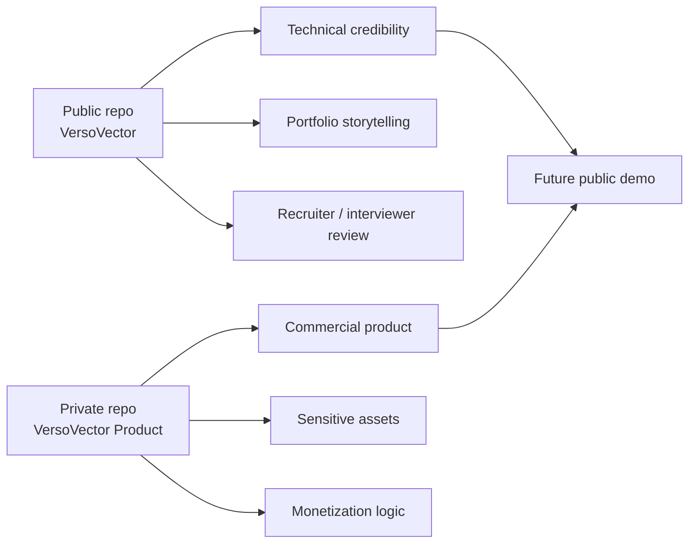

# Public Repository Strategy

VersoVector follows a dual-repository strategy.

The public repository is intended to demonstrate technical credibility, architecture, modeling direction, and portfolio-level implementation quality.

The private/product repository should protect monetizable and production-sensitive assets.

## Public repository

The public repository should remain useful for portfolio review, technical interviews, open-source inspection, and architecture storytelling.

It may include:

- clean notebooks;
- architecture documentation;
- MLOps design;
- API skeleton;
- Docker and services foundation;
- tests;
- sanitized deployment blueprints;
- lightweight examples;
- reproducible local development instructions.

It should not include:

- API keys;
- private prompts;
- private datasets;
- production credentials;
- heavy production model artifacts;
- proprietary assets;
- billing configuration;
- authentication secrets;
- advanced commercial logic;
- licensed lyrics or copyrighted corpora redistributed in full.

## Private product repository

A future private repository may be named:

```text
VersoVector-Product
VersoVector-Pro
VersoVector-Platform
```

It would contain production-only material such as:

- premium product design;
- user authentication;
- billing;
- product strategy;
- prompt and recommendation rules;
- advanced endpoints;
- licensed datasets;
- B2B connectors;
- production Terraform;
- Cloud Run deployment values;
- optimized models;
- analytics;
- monitoring;
- monetization roadmap.

## Why this split matters

This split lets the public repository show capability without giving away the full commercial product.



## Repository positioning

The public repository should answer:

> Can this person design, build, document, test, package, and deploy an NLP/MLOps product foundation?

The private repository should answer:

> Can this become a protected, monetizable product with real users, licensed content, secure infrastructure, and production operations?