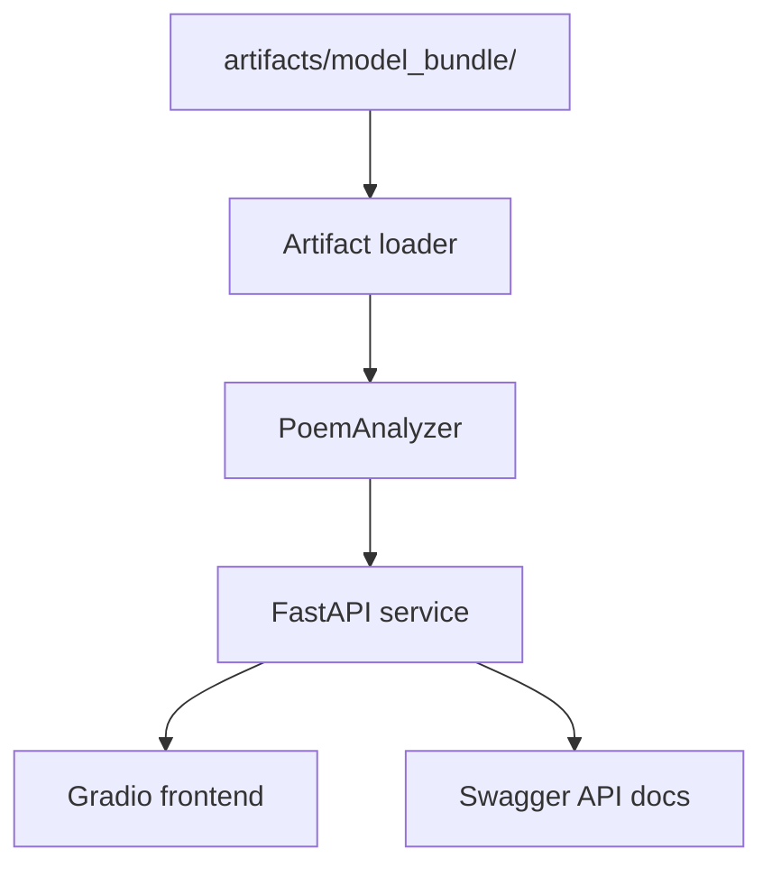

# Serving & Demo

VersoVector includes a serving foundation for local API and frontend execution.

This page explains how the public repository connects model artifacts to inference, API serving, and a local demo interface.

## Serving flow



## Generate the model bundle

Before running the API or frontend, generate the model bundle:

```bash
PYTHONPATH=src:. python -m versovector.training.build_dataset \
  --config configs/model_config.toml && \
PYTHONPATH=src:. python -m versovector.training.train_features \
  --config configs/model_config.toml && \
PYTHONPATH=src:. python -m versovector.training.train_supervised \
  --config configs/model_config.toml && \
PYTHONPATH=src:. python -m versovector.training.train_unsupervised \
  --config configs/model_config.toml && \
PYTHONPATH=src:. python -m versovector.training.register_model \
  --config configs/model_config.toml
```

Expected output:

```text
artifacts/model_bundle/
```

## Run services with Docker Compose

From the repository root:

```bash
docker compose -f services/compose.yaml up --build
```

Local services:

```text
API:
  http://localhost:8001

API docs:
  http://localhost:8001/docs

Frontend:
  http://localhost:7860
```

## Model bundle behavior

Generated model artifacts are not included in the Docker image by default.

For local development, the model bundle is mounted as a local artifact directory.

For a future hosted demo, the model bundle should be retrieved from a controlled artifact location.

## Public repository scope

The public repository is intended to show the serving foundation.

A production deployment may later add authentication, monitoring, artifact storage, rate limiting, and product-specific behavior outside the public documentation scope.